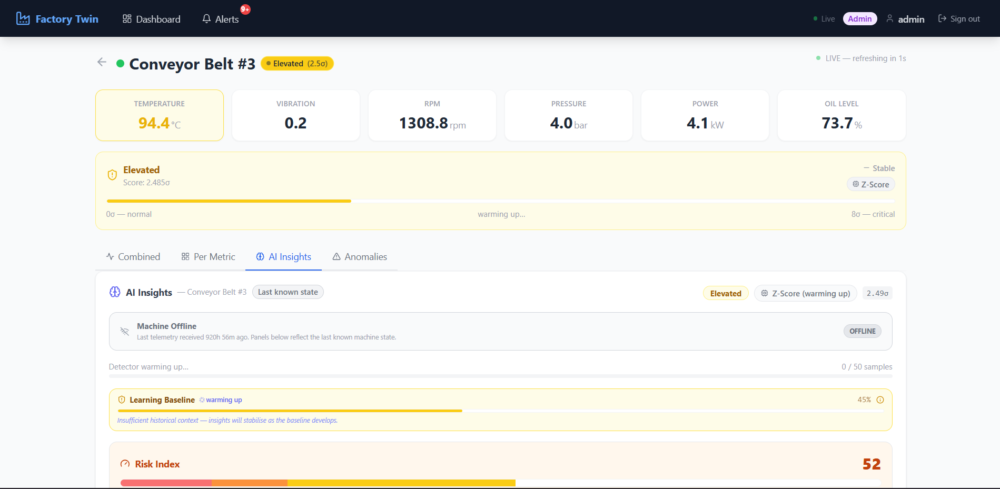
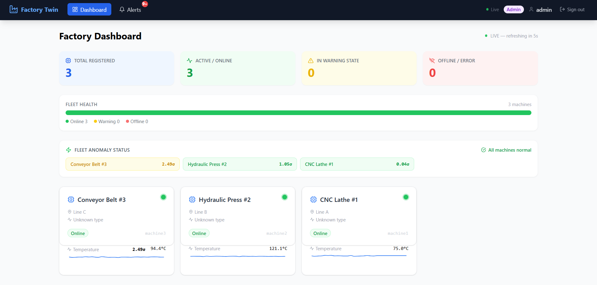
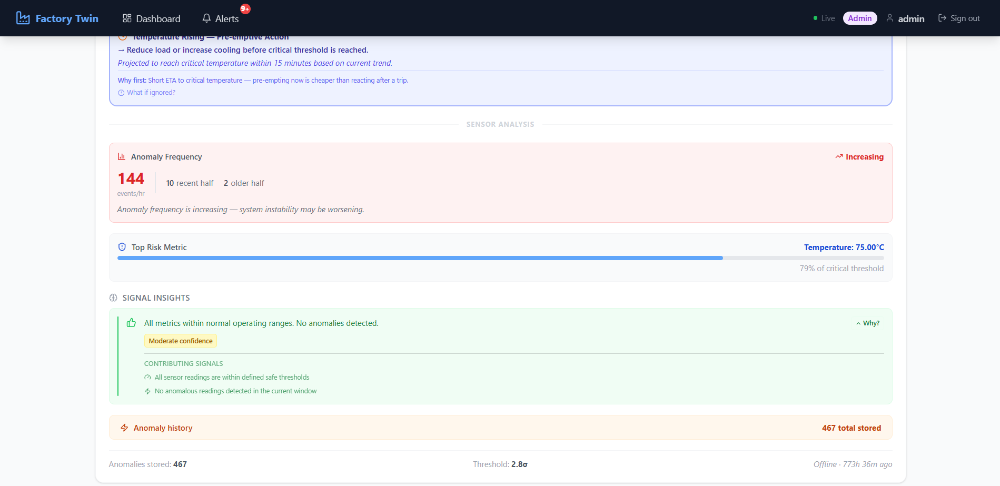
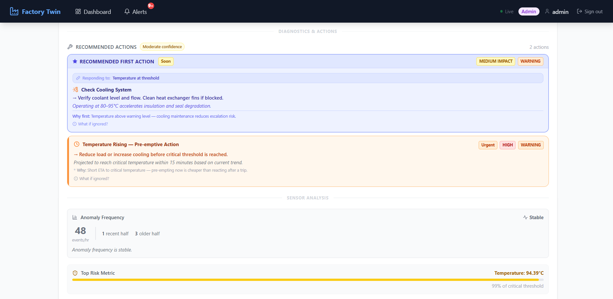

# 🏭 Factory Twin — Industrial AI Monitoring Platform

> Real-time anomaly detection, explainable AI decisions, and predictive maintenance intelligence for industrial systems — built with production-grade architecture.

[](https://python.org)
[](https://fastapi.tiangolo.com)
[](https://react.dev)
[](https://docker.com)
[](LICENSE)

&nbsp;&nbsp;🤖 Explainable anomaly detection &nbsp;·&nbsp; 🔮 Predictive maintenance intelligence &nbsp;·&nbsp; ⚡ Real-time telemetry streaming &nbsp;·&nbsp; 🏗️ Production-style architecture

---

## 🎯 Project Overview

**Factory Twin** is a digital twin platform that simulates and monitors industrial machinery in real time. It ingests live telemetry, detects anomalies using an ML pipeline, and delivers explainable, actionable intelligence to operators — not just alerts.

The platform solves a core industrial problem: traditional monitoring systems detect *that* something is wrong but not *why*. Factory Twin combines anomaly detection with SHAP-based explainability so every alert comes with attribution — which sensor, which pattern, which risk threshold.

Designed as a production-style portfolio project with resilient frontend architecture, async-safe ML inference, and six operational states reflecting real-world factory conditions.

---

## ✨ Key Features

### 🤖 AI Intelligence
- ML-powered anomaly detection running on live telemetry streams
- Multi-sensor signal fusion across temperature, vibration, pressure, and throughput
- Confidence-scored predictions with severity classification

### 🔍 Explainability
- SHAP-based feature attribution on every anomaly decision
- Per-sensor contribution scores rendered visually in the dashboard
- No black-box alerts — operators always know what triggered the system

### 🔮 Predictive Insights
- Remaining useful life (RUL) estimation for critical components
- Trend analysis and degradation trajectory modelling
- Maintenance scheduling recommendations based on predicted failure windows

### 🚦 Operational Decision Guidance
- Six distinct operational states with tailored operator guidance
- Context-aware alert routing — critical vs. advisory vs. informational
- Recovery state tracking with return-to-normal confirmation logic

### 🛡️ Reliability Engineering
- Stale telemetry detection with offline/degraded state handling
- Null-safe frontend rendering — no silent failures on missing sensor data
- Async-safe ML inference pipeline decoupled from the API response cycle

---

## 🏗️ Architecture

```
Industrial Sensors / Simulated Telemetry
              │
              ▼
      FastAPI Backend          ← REST API · telemetry ingestion · state management
              │
      ┌───────┴───────┐
      ▼               ▼
  ML Pipeline     State Engine     ← Async anomaly detection · operational state machine
      │               │
      ▼               ▼
  SHAP Explainer  Alert Router     ← Feature attribution · severity classification
              │
              ▼
      React Dashboard             ← Real-time UI · SHAP charts · operational state display
```

The ML pipeline runs asynchronously — telemetry ingestion and API responses are never blocked by inference latency. The frontend is designed to handle all six operational states gracefully, including stale or missing data.

---

## 🛠️ Tech Stack

**Frontend** &nbsp;·&nbsp; React · Vite · Recharts · Tailwind CSS

**Backend** &nbsp;·&nbsp; FastAPI · Python 3.10+ · Pydantic · Uvicorn

**ML** &nbsp;·&nbsp; Scikit-learn · SHAP · NumPy · Pandas

**Infrastructure** &nbsp;·&nbsp; Docker · Docker Compose

---

## 🚦 Operational States

The platform models six real-world factory conditions, each driving distinct UI behaviour and operator guidance:

| State | Meaning | System Response |
|---|---|---|
| 🟢 **Normal** | All sensors within thresholds | Monitoring active, no alerts |
| 🟡 **Escalation** | Early anomaly signals detected | Advisory alert, SHAP attribution shown |
| 🔴 **Critical** | High-confidence anomaly confirmed | Urgent alert, maintenance guidance triggered |
| 🔵 **Explainability** | Operator requests decision detail | Full SHAP breakdown rendered on demand |
| 🔄 **Recovery** | Anomaly resolved, stabilising | Return-to-normal confirmed before clearing |
| ⚫ **Offline / Stale** | Telemetry stream interrupted | Degraded state UI, last-known values preserved |

Each state has its own UI treatment — not just colour changes, but layout, guidance text, and available operator actions.

---

## ⚙️ Engineering Highlights

**Frontend-only intelligence** — Anomaly severity classification and display logic run client-side, keeping the UI responsive even during backend latency spikes.

**Stable insight ordering** — SHAP feature rankings are deterministically sorted so the UI never flickers between renders as values update.

**Stale telemetry realism** — The platform distinguishes between "sensor offline" and "sensor silent" — modelling real industrial edge cases where data stops without an explicit disconnect signal.

**Null safety throughout** — Every sensor field in the frontend handles `null`, `undefined`, and out-of-range values explicitly. No silent failures, no blank panels.

**Async-safe ML pipeline** — Inference is queued and processed independently of the API request cycle. High telemetry throughput doesn't degrade response times.

**Explainability on demand** — SHAP values are computed per-inference and cached. The explainability state is triggered by operator action, not automatically — reducing cognitive load during normal operations.

---

## 🚀 Quick Start

```bash
# 1. Clone the repository
git clone https://github.com/KadhirDev/factory-twin.git
cd factory-twin

# 2. Start all services
docker compose up --build

# 3. Open the dashboard
open http://localhost:5173

# 4. View API documentation
open http://localhost:8000/docs
```

All services — backend, ML pipeline, and frontend dev server — start with a single command.

---

## 📁 Project Structure

```
factory-twin/
├── frontend/           # React + Vite dashboard · state-driven UI
├── backend/
│   ├── api/            # FastAPI routes · telemetry endpoints · state management
│   ├── ml/             # Anomaly detection · SHAP explainer · async inference
│   └── simulation/     # Industrial telemetry simulator · fault injection
├── docs/
│   └── images/         # Screenshots · architecture diagrams
└── docker-compose.yml
```

---

## 📸 Dashboard

<table>
  <tr>
    <td><b>Normal Operations</b></td>
    <td><b>Anomaly Detected</b></td>
  </tr>
  <tr>
    <td></td>
    <td></td>
  </tr>
  <tr>
    <td><b>SHAP Explainability</b></td>
    <td><b>Critical State Alert</b></td>
  </tr>
  <tr>
    <td></td>
    <td></td>
  </tr>
</table>

---

## 📋 Project Status

Production-style portfolio project. Fully functional end-to-end with:

- ✅ Live telemetry simulation with fault injection
- ✅ ML anomaly detection with SHAP explainability
- ✅ Six operational states with full UI coverage
- ✅ Async-safe inference pipeline
- ✅ Dockerised single-command deployment
- ✅ Resilient frontend — handles all edge cases including stale and null telemetry

---

## 🤝 Contributing

PRs welcome. Open an issue first for significant changes.

---

> Built to demonstrate end-to-end AI system design: from real-time telemetry ingestion through ML inference and explainability to production-style operational intelligence.
